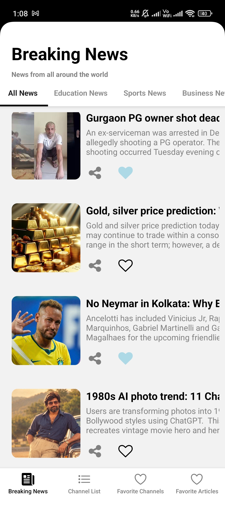
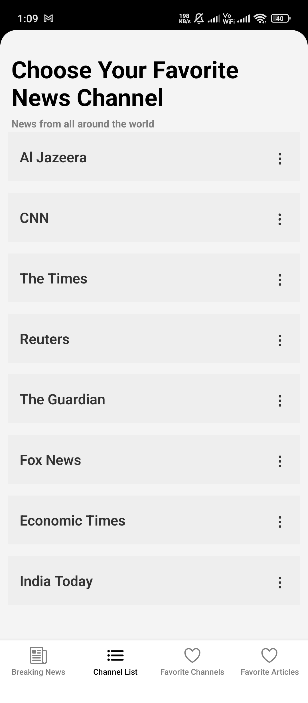
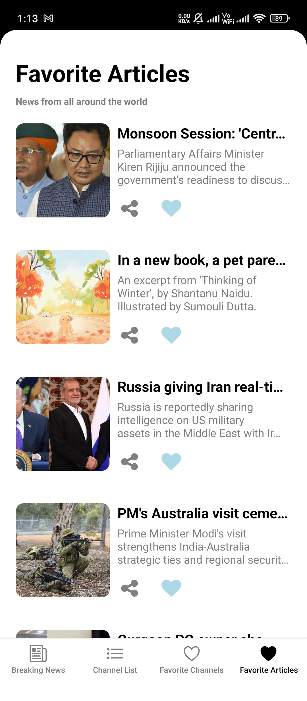
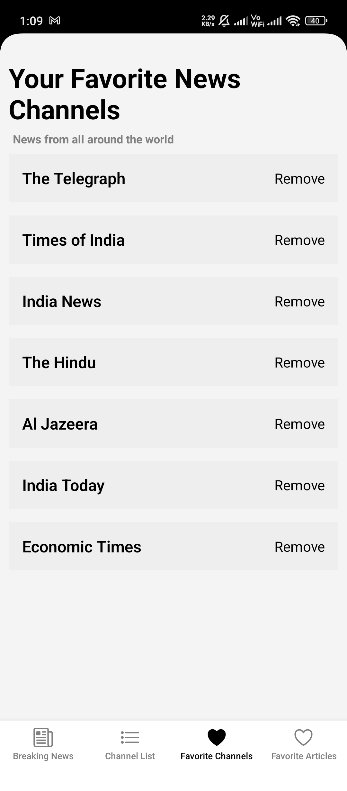

# NewsApp

A React Native mobile application that allows users to browse breaking news, explore different news categories, and save their favorite articles and channels. I built this project to practice mobile development, state management, and API integration.

## Screenshots

| Breaking News | Channel List | Favorite Articles | Favorite Channels |
| :---: | :---: | :---: | :---: |
|  |  |  |  |

## Features

* Browse breaking news
* Browse news by category (Business, Education, Science, Sports)
* View a list of news channels
* Read full articles directly in the app (via WebView)
* Bookmark favorite articles
* Save favorite news channels
* User authentication

## Tech Stack

* **React Native** (UI Framework)
* **JavaScript** 
* **React Navigation** (Native Stack & Bottom Tabs)
* **Redux Toolkit & Redux Persist** (State management and local storage)
* **Firebase** (Auth, Firestore, Storage)
* **Axios & RSS Parser** (Data fetching and parsing)
* **React Native Paper** (UI components)
* **React Native WebView** (In-app browser)

## Project Structure

```text
src/
├── appnavigation/    # Navigation setup (Stack and Bottom Tabs)
├── redux/            # State management (slices and store configuration)
├── screens/          # UI screens (Home, Categories, Favorites, Auth, etc.)
└── screenshots/      # App screenshots for documentation
```

## Getting Started

### Prerequisites

* Node.js (>= 18)
* React Native development environment (Android Studio / Xcode)

### Installation

Clone the repository and install dependencies:

```bash
git clone <repository-url>
cd NewsApp
npm install
```

### iOS

Install CocoaPods dependencies:

```bash
cd ios
pod install
cd ..
npm run ios
```

### Android

Run the app on an Android emulator or connected device:

```bash
npm run android
```

## Configuration

This project relies on Firebase. You will need to set up your own Firebase project to fully use the authentication and database features.

1. Create a project in the [Firebase Console](https://console.firebase.google.com/).
2. Add an Android app and place the `google-services.json` file inside `android/app/`.
3. Add an iOS app and place the `GoogleService-Info.plist` file inside the `ios/` folder.
4. Enable Authentication and Firestore in your Firebase project.

## What I Learned

Building this project helped me gain practical experience with several React Native concepts:

* **Navigation**: Implementing bottom tabs and native stack navigation together.
* **State Management**: Using Redux Toolkit for global state and Redux Persist to keep saved articles and channels available offline.
* **Networking**: Fetching external feeds using Axios and parsing RSS data.
* **Firebase Integration**: Setting up and using Firebase for user authentication and backend database storage.
* **In-App Browsing**: Using WebView to load full articles without leaving the application.

## Future Improvements

* Add a search functionality to find specific news or channels
* Improve UI for loading and error states
* Add offline support for recently viewed news
* Implement dark mode support

## Author

**Abhishek Lacheta**  
Mobile Application Developer | React Native & Flutter
[GitHub Profile](https://github.com/Abhishek-lacheta)
